# Mesh-Six: Architect & Researcher Sub-Workflow Implementation Plan

> **Objective**: Implement the `ResearchAndPlanSubWorkflow` to handle complex architectural planning. This utilizes a triage-and-escalation pattern, Dapr Durable Workflows, LiteLLM caching, Mem0 for scoped memory, and a Claim Check pattern via MinIO for brittle web scraping tasks.
> **Environment**: 6-node k3s homelab, Bun/TypeScript ecosystem.

---

## 1. Sequence Diagram: Triage, Escalate, and Review Loop

```mermaid
sequenceDiagram
    autonumber
    participant PM as PM Workflow
    participant Sub as Dapr Sub-Workflow
    participant Arch as Architect Actor (Gemini Pro)
    participant Res as Researcher Actor (Gemini Flash)
    participant MinIO as MinIO Storage
    participant Mac as Mac Mini (Scraper Service)

    PM->>Sub: callActivity(ResearchAndPlan)
    Sub->>Arch: callActivity(Triage)
    Arch-->>Sub: { needsDeepResearch: true, context }
    
    rect rgb(30, 40, 50)
        Note right of Sub: Phase 1: Dispatch & Hibernate
        Sub->>Res: callActivity(StartDeepResearch)
        Res->>MinIO: Write status.json (PENDING)
        Res-)Mac: Async HTTP (Start Scrape)
        Res-->>Sub: { status: "STARTED" }
        Sub->>Sub: await Promise.race([ExternalEvent, 15m Timer])
        Note right of Sub: Workflow thread shuts down (0 CPU)
    end

    rect rgb(40, 30, 30)
        Note right of Mac: Mac Mini Heavy UI Lifting
        Mac->>Mac: Drive Claude Web / Gemini UI
        Mac->>MinIO: Upload raw-scraper-result.md
        Mac->>MinIO: Update status.json (COMPLETED)
        Mac-)Sub: HTTP POST /raiseEvent/ScrapeCompleted
    end

    rect rgb(30, 50, 40)
        Note right of Sub: Phase 2: Review & Loop
        Sub->>Sub: Thread wakes up with MinIO Object ID
        Sub->>Res: callActivity(ReviewResearch)
        Res->>MinIO: Read raw-scraper-result.md
        Res->>Res: Gemini Flash formats & validates
        alt is INCOMPLETE
            Res-->>Sub: { status: "INCOMPLETE", newPrompt }
            Note right of Sub: Loops back to Phase 1
        else is APPROVED
            Res->>MinIO: Upload clean-research.md
            Res-->>Sub: { status: "APPROVED", cleanMinioId }
        end
    end

    Sub->>Arch: callActivity(DraftPlan, { cleanMinioId })
    Arch->>Arch: Gemini Pro generates feature.md
    Arch-->>Sub: finalPlan
    Sub-->>PM: Return to Main Workflow

```



---

## 2. Infrastructure Configuration

### 2.1 LiteLLM Proxy Gateway (`config.yaml`)

Configure LiteLLM to act as the universal OpenAI-compatible gateway, utilizing the Redis HA cluster for exact-match embedding caching to prevent redundant Ollama/API calls.

```yaml
model_list:
  - model_name: gemini-1.5-pro
    litellm_params:
      model: gemini/gemini-1.5-pro
  - model_name: gemini-1.5-flash
    litellm_params:
      model: gemini/gemini-1.5-flash
  - model_name: phi3.5-mini
    litellm_params:
      model: ollama/phi3.5-mini
      api_base: http://ollama:11434
  - model_name: mxbai-embed-large
    litellm_params:
      model: ollama/mxbai-embed-large
      api_base: http://ollama:11434

litellm_settings:
  cache: true
  cache_params:
    type: redis
    host: "redis-cluster.redis"
    port: 6379
    password: "os.environ/REDIS_PASSWORD"
    max_connections: 100
general_settings:
  database_connection_pool_limit: 10

```

*Deployment Note: Run LiteLLM on the dedicated Ubuntu server using `--num_workers $(nproc)` to maximize CPU utilization across the shared port 4000.*

---

## 3. Core Library Additions (`@mesh-six/core`)

### 3.1 Mem0 Integration Wrapper

Initializes Mem0 to route through LiteLLM.

```typescript
// packages/core/src/memory.ts
import { Memory } from "mem0ai";

export class AgentMemory {
  private memory: Memory;
  public agentId: string;

  constructor(agentId: string) {
    this.agentId = agentId;
    this.memory = new Memory({
      vector_store: {
        provider: "pgvector",
        config: {
          collection_name: `mesh_six_${agentId}`,
          host: process.env.PG_PRIMARY_HOST,
          port: Number(process.env.PG_PRIMARY_PORT || 5432),
          user: process.env.PG_PRIMARY_USER,
          password: process.env.PG_PRIMARY_PASSWORD,
          dbname: process.env.PG_PRIMARY_DB,
        },
      },
      llm: {
        provider: "openai", 
        config: {
          model: process.env.MEMORY_MODEL || "phi3.5-mini", 
          api_key: process.env.LITELLM_API_KEY,
          openai_base_url: process.env.LITELLM_BASE_URL
        },
      },
      embedder: {
        provider: "openai", 
        config: {
          model: process.env.EMBEDDING_MODEL || "mxbai-embed-large",
          api_key: process.env.LITELLM_API_KEY,
          openai_base_url: process.env.LITELLM_BASE_URL
        },
      },
    });
  }

  async remember(query: string, scopeId?: string): Promise<string[]> {
    const results = await this.memory.search(query, { user_id: scopeId, limit: 5 });
    return results?.map((r: any) => r.memory) || [];
  }

  async store(messages: Array<{ role: string; content: string }>, scopeId?: string): Promise<void> {
    await this.memory.add(messages, { user_id: scopeId });
  }
}

```

### 3.2 Global Reflection Prompt

```typescript
// packages/core/src/prompts/architect-reflection.ts
export const ARCHITECT_REFLECTION_PROMPT = `
You are the Architect agent concluding an architectural planning or review phase.
Extract valuable insights into concise, factual statements. Do not store raw conversation or temporary task states.

Evaluate your learnings against the established baseline environment:
- Infrastructure: 6-node k3s, Dapr sidecars, PostgreSQL HA, Redis HA, RabbitMQ HA, Longhorn, Minio S3.
- Networking: OPNsense, Traefik, Kube-VIP, Cloudflare DNS/Zero Trust.
- Source Control: Dual remotes utilizing both Gitea and GitHub.
- Approved Tech Stack: Bun, Go, .NET (strictly for API and background workers), Node.js.
- Banned Tech Stack: Python (never recommend, use, or store Python workarounds).

Categorize each extracted memory into one of the following scopes:
1. "task": Implementation details strictly relevant to finishing the current issue.
2. "project": Broad architectural rules for this specific repository/service.
3. "global": Universal learnings about the infrastructure that apply to all future projects.

Respond ONLY with valid JSON matching this schema:
{ "memories": [{ "content": "...", "scope": "task" | "project" | "global" }] }
`;

```

### 3.3 Research Tools Schema

```typescript
// packages/core/src/tools/web-research.ts
export const webResearchTools = [
  {
    type: "function",
    function: {
      name: "googleSearch", // Triggers Gemini Native Grounding
      description: "Use Google Search for quick, real-time factual lookups and discovery."
    }
  },
  {
    type: "function",
    function: {
      name: "web_fetch",
      description: "Extract the full markdown text of a specific URL. Use this to read full documentation pages.",
      parameters: {
        type: "object",
        properties: { url: { type: "string" } },
        required: ["url"]
      }
    }
  }
];

```

---

## 4. Sub-Workflow Orchestration (`apps/project-manager/src/sub-workflows.ts`)

```typescript
import { WorkflowContext } from "@dapr/dapr";

export async function ResearchAndPlanSubWorkflow(ctx: WorkflowContext, input: any) {
  // 1. Triage
  let currentContext = await ctx.callActivity("ArchitectTriageActivity", input);
  let isResearchComplete = !currentContext.needsDeepResearch;
  let finalResearchDocId = null;

  // 2. Iterative Deep Research Loop
  while (!isResearchComplete) {
    // Dispatch and hibernate
    await ctx.callActivity("StartDeepResearchActivity", currentContext);
    
    const scrapeEvent = ctx.waitForExternalEvent("ScrapeCompleted");
    const timeoutEvent = ctx.createTimer(15 * 60 * 1000).then(() => "TIMEOUT");
    
    // Workflow consumes 0 CPU here
    const rawMinioId = await Promise.race([scrapeEvent, timeoutEvent]);

    if (rawMinioId === "TIMEOUT") {
      await ctx.callActivity("SendPushNotificationActivity", { message: `Scraper timed out on ${input.taskId}` });
      break; // Fallback to shallow triage data
    }

    // 3. Review & Format
    const reviewResult = await ctx.callActivity("ReviewResearchActivity", {
      taskId: input.taskId,
      rawMinioId: rawMinioId
    });

    if (reviewResult.status === "APPROVED") {
      finalResearchDocId = reviewResult.cleanMinioId;
      isResearchComplete = true; 
    } else if (reviewResult.status === "INCOMPLETE") {
      // Loop back with updated questions
      currentContext.followUpPrompt = reviewResult.newFollowUpPrompt;
    }
  }

  // 4. Final Plan Drafting
  return await ctx.callActivity("ArchitectDraftPlanActivity", {
    initialContext: currentContext.context,
    deepResearchDocId: finalResearchDocId
  });
}

```

---

## 5. Agent Implementations

### 5.1 Researcher Actor: Dispatch & Claim Check

```typescript
// Inside ResearcherActor implementation
async startDeepResearch(context: any) {
  const minioPath = `mesh-six/research/${context.taskId}/status.json`;
  
  // Claim Check: Is it already done?
  const existingStatus = await minioClient.readStatus(minioPath);
  if (existingStatus === "COMPLETED") {
    return { status: "COMPLETED" }; 
  }

  // Write PENDING state
  await minioClient.writeStatus(minioPath, "PENDING");

  // Fire and forget to Mac Mini
  await this.daprClient.invoker.invoke(
    "mac-mini-scraper-service", 
    "startScrape", 
    HttpMethod.POST, 
    { prompt: context.prompt, taskId: context.taskId }
  );

  return { status: "STARTED" };
}

```

### 5.2 Researcher Actor: Review Phase

```typescript
// Inside ResearcherActor implementation
async reviewResearch(input: { taskId: string, rawMinioId: string }) {
  const rawData = await minioClient.read(input.rawMinioId);
  
  // Use Gemini Flash to validate and strip garbage
  const review = await chatCompletionWithSchema({
    model: "gemini-1.5-flash",
    schema: ReviewResultSchema,
    system: "You are a research validation agent. Extract core technical specs. If the text is a CAPTCHA or refusal, mark INCOMPLETE.",
    prompt: `Original Prompt: ${input.prompt}\nRaw Scrape: ${rawData}`
  });

  if (review.object.status === "APPROVED") {
    const cleanId = `mesh-six/research/${input.taskId}/clean-research.md`;
    await minioClient.write(cleanId, review.object.formattedMarkdown);
    return { status: "APPROVED", cleanMinioId: cleanId };
  }

  return { status: "INCOMPLETE", newFollowUpPrompt: review.object.missingInformation };
}

```

### 5.3 Mac Mini Scraper Service (External)

Stateless webhook receiver running on the Mac Mini.

```bash
# Executed upon completion by the Playwright/Puppeteer script
curl -X POST http://localhost:3500/v1.0-alpha1/workflows/dapr/FeatureWorkflow/${TASK_ID}/raiseEvent/ScrapeCompleted \
  -H "Content-Type: application/json" \
  -d '"mesh-six/research/task-123/raw-scraper-result.md"'

```