You are a Senior Staff Engineer working on Multi Agent platform called Mesh Six. There was is a new PR that includes an agent workflow dapr activities between the Architect Agent and the Researcher Agent. The branch is already loaded here and the changes you will be making is based from the reviews 4 AI Models below. Review all their analysis and analyze the Mesh Six master plan is available here: @docs/PLAN.md which is the overarching plan for the project. Once you have reviewed everything below, select what should be fixed or implemented and deliver the final code changes in this same branch. This PR is #13 in Github at https://github.com/jaybrto/mesh-six/pull/13. When complete, provide a summary of the changes made and the reasoning behind them.

# The PR is as follows:

<pr>
feat: implement ResearchAndPlan sub-workflow for complex architectural planning
Adds a Dapr Durable Workflow that orchestrates triage → deep research → review → plan
drafting. The Architect triages tasks via Gemini Pro to determine if external research is
needed, then dispatches to an external scraper service via Dapr service invocation. The
workflow hibernates (0 CPU) while awaiting scraper results via external events with a 15-min
timeout fallback. A Gemini Flash-powered review loop validates and formats raw scrape data
before the Architect synthesizes everything into a final implementation plan.

Key patterns:
- Claim Check via MinIO for large research documents
- Timer-based hibernation with external event wake-up
- Iterative review loop (max 3 cycles) with follow-up prompts
- ntfy push notifications for scraper timeouts
- PostgreSQL research_sessions table for state tracking

New files:
- @mesh-six/core: research-types.ts, research-minio.ts, prompts/architect-reflection.ts,
  tools/web-research.ts, research-types.test.ts (24 tests)
- @mesh-six/project-manager: research-sub-workflow.ts, research-activities.ts
- migrations/014_research_sessions.sql
- scripts/test-research-workflow.ts (multi-mode test script)
</pr>

# The initial implementation plan that was followed

<spec>
# Mesh-Six: Architect & Researcher Sub-Workflow Implementation Plan

> **Objective**: Implement the `ResearchAndPlanSubWorkflow` to handle complex architectural planning. This utilizes a triage-and-escalation pattern, Dapr Durable Workflows, LiteLLM caching, Mem0 for scoped memory, and a Claim Check pattern via MinIO for brittle web scraping tasks.
> **Environment**: 6-node k3s homelab, Bun/TypeScript ecosystem.

---

## 1. Sequence Diagram: Triage, Escalate, and Review Loop

```mermaid
sequenceDiagram
    autonumber
    participant PM as PM Workflow
    participant Sub as Dapr Sub-Workflow
    participant Arch as Architect Actor (Gemini Pro)
    participant Res as Researcher Actor (Gemini Flash)
    participant MinIO as MinIO Storage
    participant Mac as Mac Mini (Scraper Service)

    PM->>Sub: callActivity(ResearchAndPlan)
    Sub->>Arch: callActivity(Triage)
    Arch-->>Sub: { needsDeepResearch: true, context }
    
    rect rgb(30, 40, 50)
        Note right of Sub: Phase 1: Dispatch & Hibernate
        Sub->>Res: callActivity(StartDeepResearch)
        Res->>MinIO: Write status.json (PENDING)
        Res-)Mac: Async HTTP (Start Scrape)
        Res-->>Sub: { status: "STARTED" }
        Sub->>Sub: await Promise.race([ExternalEvent, 15m Timer])
        Note right of Sub: Workflow thread shuts down (0 CPU)
    end

    rect rgb(40, 30, 30)
        Note right of Mac: Mac Mini Heavy UI Lifting
        Mac->>Mac: Drive Claude Web / Gemini UI
        Mac->>MinIO: Upload raw-scraper-result.md
        Mac->>MinIO: Update status.json (COMPLETED)
        Mac-)Sub: HTTP POST /raiseEvent/ScrapeCompleted
    end

    rect rgb(30, 50, 40)
        Note right of Sub: Phase 2: Review & Loop
        Sub->>Sub: Thread wakes up with MinIO Object ID
        Sub->>Res: callActivity(ReviewResearch)
        Res->>MinIO: Read raw-scraper-result.md
        Res->>Res: Gemini Flash formats & validates
        alt is INCOMPLETE
            Res-->>Sub: { status: "INCOMPLETE", newPrompt }
            Note right of Sub: Loops back to Phase 1
        else is APPROVED
            Res->>MinIO: Upload clean-research.md
            Res-->>Sub: { status: "APPROVED", cleanMinioId }
        end
    end

    Sub->>Arch: callActivity(DraftPlan, { cleanMinioId })
    Arch->>Arch: Gemini Pro generates feature.md
    Arch-->>Sub: finalPlan
    Sub-->>PM: Return to Main Workflow

```



---

## 2. Infrastructure Configuration

### 2.1 LiteLLM Proxy Gateway (`config.yaml`)

Configure LiteLLM to act as the universal OpenAI-compatible gateway, utilizing the Redis HA cluster for exact-match embedding caching to prevent redundant Ollama/API calls.

```yaml
model_list:
  - model_name: gemini-1.5-pro
    litellm_params:
      model: gemini/gemini-1.5-pro
  - model_name: gemini-1.5-flash
    litellm_params:
      model: gemini/gemini-1.5-flash
  - model_name: phi3.5-mini
    litellm_params:
      model: ollama/phi3.5-mini
      api_base: http://ollama:11434
  - model_name: mxbai-embed-large
    litellm_params:
      model: ollama/mxbai-embed-large
      api_base: http://ollama:11434

litellm_settings:
  cache: true
  cache_params:
    type: redis
    host: "redis-cluster.redis"
    port: 6379
    password: "os.environ/REDIS_PASSWORD"
    max_connections: 100
general_settings:
  database_connection_pool_limit: 10

```

*Deployment Note: Run LiteLLM on the dedicated Ubuntu server using `--num_workers $(nproc)` to maximize CPU utilization across the shared port 4000.*

---

## 3. Core Library Additions (`@mesh-six/core`)

### 3.1 Mem0 Integration Wrapper

Initializes Mem0 to route through LiteLLM.

```typescript
// packages/core/src/memory.ts
import { Memory } from "mem0ai";

export class AgentMemory {
  private memory: Memory;
  public agentId: string;

  constructor(agentId: string) {
    this.agentId = agentId;
    this.memory = new Memory({
      vector_store: {
        provider: "pgvector",
        config: {
          collection_name: `mesh_six_${agentId}`,
          host: process.env.PG_PRIMARY_HOST,
          port: Number(process.env.PG_PRIMARY_PORT || 5432),
          user: process.env.PG_PRIMARY_USER,
          password: process.env.PG_PRIMARY_PASSWORD,
          dbname: process.env.PG_PRIMARY_DB,
        },
      },
      llm: {
        provider: "openai", 
        config: {
          model: process.env.MEMORY_MODEL || "phi3.5-mini", 
          api_key: process.env.LITELLM_API_KEY,
          openai_base_url: process.env.LITELLM_BASE_URL
        },
      },
      embedder: {
        provider: "openai", 
        config: {
          model: process.env.EMBEDDING_MODEL || "mxbai-embed-large",
          api_key: process.env.LITELLM_API_KEY,
          openai_base_url: process.env.LITELLM_BASE_URL
        },
      },
    });
  }

  async remember(query: string, scopeId?: string): Promise<string[]> {
    const results = await this.memory.search(query, { user_id: scopeId, limit: 5 });
    return results?.map((r: any) => r.memory) || [];
  }

  async store(messages: Array<{ role: string; content: string }>, scopeId?: string): Promise<void> {
    await this.memory.add(messages, { user_id: scopeId });
  }
}

```

### 3.2 Global Reflection Prompt

```typescript
// packages/core/src/prompts/architect-reflection.ts
export const ARCHITECT_REFLECTION_PROMPT = `
You are the Architect agent concluding an architectural planning or review phase.
Extract valuable insights into concise, factual statements. Do not store raw conversation or temporary task states.

Evaluate your learnings against the established baseline environment:
- Infrastructure: 6-node k3s, Dapr sidecars, PostgreSQL HA, Redis HA, RabbitMQ HA, Longhorn, Minio S3.
- Networking: OPNsense, Traefik, Kube-VIP, Cloudflare DNS/Zero Trust.
- Source Control: Dual remotes utilizing both Gitea and GitHub.
- Approved Tech Stack: Bun, Go, .NET (strictly for API and background workers), Node.js.
- Banned Tech Stack: Python (never recommend, use, or store Python workarounds).

Categorize each extracted memory into one of the following scopes:
1. "task": Implementation details strictly relevant to finishing the current issue.
2. "project": Broad architectural rules for this specific repository/service.
3. "global": Universal learnings about the infrastructure that apply to all future projects.

Respond ONLY with valid JSON matching this schema:
{ "memories": [{ "content": "...", "scope": "task" | "project" | "global" }] }
`;

```

### 3.3 Research Tools Schema

```typescript
// packages/core/src/tools/web-research.ts
export const webResearchTools = [
  {
    type: "function",
    function: {
      name: "googleSearch", // Triggers Gemini Native Grounding
      description: "Use Google Search for quick, real-time factual lookups and discovery."
    }
  },
  {
    type: "function",
    function: {
      name: "web_fetch",
      description: "Extract the full markdown text of a specific URL. Use this to read full documentation pages.",
      parameters: {
        type: "object",
        properties: { url: { type: "string" } },
        required: ["url"]
      }
    }
  }
];

```

---

## 4. Sub-Workflow Orchestration (`apps/project-manager/src/sub-workflows.ts`)

```typescript
import { WorkflowContext } from "@dapr/dapr";

export async function ResearchAndPlanSubWorkflow(ctx: WorkflowContext, input: any) {
  // 1. Triage
  let currentContext = await ctx.callActivity("ArchitectTriageActivity", input);
  let isResearchComplete = !currentContext.needsDeepResearch;
  let finalResearchDocId = null;

  // 2. Iterative Deep Research Loop
  while (!isResearchComplete) {
    // Dispatch and hibernate
    await ctx.callActivity("StartDeepResearchActivity", currentContext);
    
    const scrapeEvent = ctx.waitForExternalEvent("ScrapeCompleted");
    const timeoutEvent = ctx.createTimer(15 * 60 * 1000).then(() => "TIMEOUT");
    
    // Workflow consumes 0 CPU here
    const rawMinioId = await Promise.race([scrapeEvent, timeoutEvent]);

    if (rawMinioId === "TIMEOUT") {
      await ctx.callActivity("SendPushNotificationActivity", { message: `Scraper timed out on ${input.taskId}` });
      break; // Fallback to shallow triage data
    }

    // 3. Review & Format
    const reviewResult = await ctx.callActivity("ReviewResearchActivity", {
      taskId: input.taskId,
      rawMinioId: rawMinioId
    });

    if (reviewResult.status === "APPROVED") {
      finalResearchDocId = reviewResult.cleanMinioId;
      isResearchComplete = true; 
    } else if (reviewResult.status === "INCOMPLETE") {
      // Loop back with updated questions
      currentContext.followUpPrompt = reviewResult.newFollowUpPrompt;
    }
  }

  // 4. Final Plan Drafting
  return await ctx.callActivity("ArchitectDraftPlanActivity", {
    initialContext: currentContext.context,
    deepResearchDocId: finalResearchDocId
  });
}

```

---

## 5. Agent Implementations

### 5.1 Researcher Actor: Dispatch & Claim Check

```typescript
// Inside ResearcherActor implementation
async startDeepResearch(context: any) {
  const minioPath = `mesh-six/research/${context.taskId}/status.json`;
  
  // Claim Check: Is it already done?
  const existingStatus = await minioClient.readStatus(minioPath);
  if (existingStatus === "COMPLETED") {
    return { status: "COMPLETED" }; 
  }

  // Write PENDING state
  await minioClient.writeStatus(minioPath, "PENDING");

  // Fire and forget to Mac Mini
  await this.daprClient.invoker.invoke(
    "mac-mini-scraper-service", 
    "startScrape", 
    HttpMethod.POST, 
    { prompt: context.prompt, taskId: context.taskId }
  );

  return { status: "STARTED" };
}

```

### 5.2 Researcher Actor: Review Phase

```typescript
// Inside ResearcherActor implementation
async reviewResearch(input: { taskId: string, rawMinioId: string }) {
  const rawData = await minioClient.read(input.rawMinioId);
  
  // Use Gemini Flash to validate and strip garbage
  const review = await chatCompletionWithSchema({
    model: "gemini-1.5-flash",
    schema: ReviewResultSchema,
    system: "You are a research validation agent. Extract core technical specs. If the text is a CAPTCHA or refusal, mark INCOMPLETE.",
    prompt: `Original Prompt: ${input.prompt}\nRaw Scrape: ${rawData}`
  });

  if (review.object.status === "APPROVED") {
    const cleanId = `mesh-six/research/${input.taskId}/clean-research.md`;
    await minioClient.write(cleanId, review.object.formattedMarkdown);
    return { status: "APPROVED", cleanMinioId: cleanId };
  }

  return { status: "INCOMPLETE", newFollowUpPrompt: review.object.missingInformation };
}

```

### 5.3 Mac Mini Scraper Service (External)

Stateless webhook receiver running on the Mac Mini.

```bash
# Executed upon completion by the Playwright/Puppeteer script
curl -X POST http://localhost:3500/v1.0-alpha1/workflows/dapr/FeatureWorkflow/${TASK_ID}/raiseEvent/ScrapeCompleted \
  -H "Content-Type: application/json" \
  -d '"mesh-six/research/task-123/raw-scraper-result.md"'

```
</spec>

---

# Claude Opus 4.6 Review

<claude-opus-4.6>
## Critical Issues

### C1. `Promise.race` may break Dapr Workflow replay determinism
**File:** `apps/project-manager/src/research-sub-workflow.ts:165-168`

```typescript
const scrapeEvent = ctx.waitForExternalEvent("ScrapeCompleted");
const timeoutTimer = ctx.createTimer(RESEARCH_TIMEOUT_MS);
const raceResult: unknown = yield Promise.race([scrapeEvent, timeoutTimer]);
```

Dapr Durable Workflows rely on deterministic replay — every `yield` must produce the same result when the workflow is replayed from history. `ctx.waitForExternalEvent()` and `ctx.createTimer()` return Dapr `Task` objects designed for the replay engine. Wrapping them in `Promise.race` creates a native Promise **outside the durable task framework's control**, which may not replay correctly.

**Fix:** Use the SDK's built-in `ctx.whenAny()` (or equivalent task combinator) instead of `Promise.race`. If the JS SDK doesn't expose `whenAny`, yield each task separately with a cancel pattern, or verify against the `@dapr/dapr@3.6.1` source that `Promise.race` with yielded tasks is explicitly supported.

### C2. Timeout detection is fragile / ambiguous
**File:** `apps/project-manager/src/research-sub-workflow.ts:171`

```typescript
if (raceResult === undefined || raceResult === null) {
```

This assumes the timer resolves to `undefined`/`null`. But if the external event's payload is also `null` or `undefined` (e.g., scraper sends empty payload), this would be **falsely treated as a timeout**. The two paths are indistinguishable.

**Fix:** Use a sentinel value or wrap with discriminated results. E.g., yield each task separately and check which completed, or have the timer return a known sentinel like `"__TIMEOUT__"`.

---

## High-Priority Issues

### H1. `downloadRawResearch` used to fetch the **clean** research doc
**File:** `apps/project-manager/src/research-activities.ts:322`

```typescript
const researchDoc = await downloadRawResearch(minioClient, bucket, input.deepResearchDocId);
```

`deepResearchDocId` is the key returned by `uploadCleanResearch` — it's a **clean** doc. This should use `downloadCleanResearch` for semantic correctness. Both functions delegate to the same `downloadFromMinio`, so it works at runtime, but it's misleading and will cause confusion during maintenance.

### H2. `workflow_id` is never backfilled in `research_sessions`
**File:** `apps/project-manager/src/research-activities.ts:105`

```typescript
"", // workflow_id filled later
```

No subsequent code ever updates `workflow_id` on the `research_sessions` row. The `idx_research_sessions_workflow_id` index is useless. Either pass the workflow ID through the activity input and set it during triage INSERT, or add an UPDATE in the sub-workflow after triage completes.

### H3. `SCRAPE_COMPLETED_EVENT` constant exists but isn't used
**File:** `apps/project-manager/src/research-sub-workflow.ts:165`

```typescript
const scrapeEvent = ctx.waitForExternalEvent("ScrapeCompleted");
```

The constant `SCRAPE_COMPLETED_EVENT = "ScrapeCompleted"` is defined in `research-types.ts:168` but the workflow hardcodes the string. Use the constant for consistency and to prevent drift.

### H4. `raw_minio_key` column never written
**File:** `migrations/014_research_sessions.sql:13` defines `raw_minio_key TEXT`, but no activity ever writes to this column. The `startDeepResearch` activity should store the raw key, or the `reviewResearch` activity should record it before processing.

### H5. `research_cycles` DB value doesn't match workflow count
The workflow increments `totalResearchCycles` at loop start (line 129), but the DB increment happens only on INCOMPLETE review (line 281-284). If the first review is APPROVED, `research_cycles` stays at 0 in the DB while the workflow reports 1. Either increment the DB at cycle start or reconcile at the end.

---

## Moderate Issues

### M1. No MinIO bucket auto-creation
All MinIO operations assume `mesh-six-research` bucket exists. If it doesn't, every operation will throw. Add a `createBucketIfNotExists` call during startup (in `index.ts:1963-1978` where MinIO client is created) or in the first activity that touches MinIO.

### M2. Double COMPLETED status on `research_sessions`
- `reviewResearch` sets `status = 'COMPLETED', completed_at = NOW()` when approved (line 263-267)
- `architectDraftPlan` also sets `status = 'COMPLETED', completed_at = NOW()` (line 344-348)

The second overwrites `completed_at` from the first. Consider using `COMPLETED_RESEARCH` vs `COMPLETED_PLAN` or only setting final status in `architectDraftPlan`.

### M3. Missing `pg` dependency in project-manager
**File:** `apps/project-manager/package.json`

`research-activities.ts` imports `type { Pool } from "pg"`, but `pg` is not in project-manager's `package.json`. It resolves via hoisted `node_modules` from `@mesh-six/core`, which is fragile. Add `pg` (and `@types/pg` as devDep) to project-manager's package.json, or re-export the type from core.

### M4. Mutable module-level activity stubs hinder testability
**File:** `apps/project-manager/src/research-sub-workflow.ts:51-64`

The `let` activity stubs mutated by `registerResearchWorkflow` make unit testing the workflow difficult — test state leaks across files. Consider passing activities via the workflow input or using a factory pattern that returns a fresh workflow function per registration.

---

## Low-Priority / Polish

### L1. Test script mode parsing doesn't handle `--mode triage` (space-separated)
Line 48 of `test-research-workflow.ts`: `process.argv[2]?.replace(...)` only handles `--mode=triage`. If invoked as `--mode triage`, the mode would be `--mode` and the actual value is in `argv[3]`. Use a minimal arg parser or check both forms.

### L2. `full` mode is misleadingly named
The `full` test mode runs offline-only tests (triage + dispatch + review + db), not the full Dapr workflow. Rename to `offline` and keep `workflow` for the Dapr end-to-end test.

### L3. `webResearchTools` and `buildResearchSystemPrompt` are unused
Exported from core but never imported by any activity. If these are scaffolding for future use, add a `// TODO` comment. Otherwise remove dead code.

---

## Gap Analysis vs. Spec

| Spec Requirement | Status | Notes |
|---|---|---|
| Triage via Gemini Pro | **Implemented** | `architectTriage` uses `LLM_MODEL_PRO` |
| Claim Check via MinIO | **Implemented** | `writeResearchStatus` / `readResearchStatus` |
| Timer-based hibernation | **Implemented** | `ctx.createTimer(RESEARCH_TIMEOUT_MS)` (see C1 re: `Promise.race`) |
| External event wake-up | **Implemented** | `ctx.waitForExternalEvent("ScrapeCompleted")` |
| Iterative review loop (max 3) | **Implemented** | `MAX_RESEARCH_CYCLES = 3` with while loop |
| Gemini Flash review/validation | **Implemented** | `reviewResearch` uses `LLM_MODEL_FLASH` |
| ntfy push notifications | **Implemented** | `sendPushNotification` activity (not in original spec, good addition) |
| PostgreSQL state tracking | **Implemented** | `research_sessions` table (not in original spec, good addition) |
| **Mem0 scoped memory** | **Missing** | Spec explicitly requires Mem0 integration for storing learnings. `ARCHITECT_REFLECTION_PROMPT` is defined but never called. No `transitionClose` or memory.store() in any research activity |
| **Researcher Actor pattern** | **Simplified** | Spec shows a Researcher Actor; implementation uses plain activities. This is a valid simplification for Dapr Workflows, but means no actor state persistence between calls |
| **LiteLLM caching** | **External** | Handled by LiteLLM proxy config, not in this PR's scope |

### Key gap: Mem0 reflection is scaffolded but not wired

The `ARCHITECT_REFLECTION_PROMPT` is defined and exported, but no activity calls `transitionClose()` or `memory.store()` after the workflow completes. The spec's core value proposition of **extracting durable memories** from each research cycle is not realized. Recommend adding a final `reflectAndStore` activity after `architectDraftPlan` that uses the existing `transitionClose` helper from `@mesh-six/core`.

---

## Recommendations Summary

| Priority | Item | Action |
|---|---|---|
| **Critical** | C1 | Replace `Promise.race` with Dapr SDK task combinator or verify replay safety |
| **Critical** | C2 | Use discriminated timeout detection, not null check |
| **High** | H1 | Use `downloadCleanResearch` for clean doc |
| **High** | H2 | Wire `workflow_id` into research_sessions |
| **High** | H3 | Use `SCRAPE_COMPLETED_EVENT` constant |
| **High** | H4 | Write `raw_minio_key` to DB |
| **High** | H5 | Align DB `research_cycles` with workflow count |
| **Moderate** | M1 | Add bucket auto-creation at startup |
| **Moderate** | M2 | Deduplicate COMPLETED status writes |
| **Moderate** | M3 | Add `pg` to project-manager deps |
| **Moderate** | M4 | Improve testability of activity stubs |
| **Gap** | Mem0 | Add reflection activity to store learnings |

</claude-opus-4.6>

---

# Gemini 3.1 Pro Review

<Gemini 3.1 Pro>
## 2. Gap Analysis & Potential Issues

**1. Overly Aggressive Token Truncation**
In `reviewResearch` and `architectDraftPlan`, the raw data is sliced via `rawData.slice(0, 50_000)` and `researchDoc.slice(0, 30_000)`. 
* *Impact*: 50,000 characters is roughly 12,500 tokens. Gemini 1.5 Flash supports 1M tokens, and Gemini 1.5 Pro supports 2M tokens. This arbitrary truncation completely neuters the models' massive context window capabilities and will likely cut off the actual documentation needed, leading to failed research cycles.

**2. Brittle External Event Payload Handling**
In `research-sub-workflow.ts`, the external event result is parsed with `typeof raceResult === "string"`.
* *Impact*: The `curl` command in the documentation sends `-d '"mesh-six/.../raw-scraper-result.md"'` (a JSON string). If the scraper script implementation changes slightly to send a standard JSON object like `{"key": "..."}`, the workflow will silently fail to extract the key and fallback to a guessed path.

**3. Graceful Degradation Hallucination Risks**
If the workflow breaks out of the loop due to a timeout or hitting `MAX_RESEARCH_CYCLES` without a valid scrape, it falls through to `ArchitectDraftPlanActivity` with `deepResearchDocId: undefined`.
* *Impact*: The Architect is never explicitly told *why* it didn't get research data. It might assume no research was needed and hallucinate APIs or dependencies rather than explicitly noting in the implementation plan that the research phase failed.

**4. Dispatch Failure is Terminal**
If `daprClient.invoker.invoke` fails in `startDeepResearchActivity` (e.g., the Mac Mini is temporarily offline or rebooting), it returns `status: "FAILED"`. The workflow then immediately breaks the loop and falls through to planning. 
* *Impact*: Given the generous 15-minute timeout budget, giving up immediately on a synchronous dispatch failure reduces resilience. 

**5. Hardcoded Identifiers & Uncancelled Timers**
* `SCRAPER_SERVICE_APP_ID = "mac-mini-scraper"` is hardcoded in `research-types.ts`. It should be configurable via environment variables to allow testing in different environments.
* The `ctx.createTimer` promise remains pending if the `scrapeEvent` wins the race. While Dapr's JS SDK handles this eventually when the orchestration finishes, it's a known edge case that can lead to dangling timers in the durable task backend.

## 3. Recommendations for Implementation

1. **Remove or Increase Truncation Limits**: Increase the slice limits to at least `500_000` characters, or remove them entirely to let LiteLLM / Gemini handle the large context.
2. **Standardize the Scraper Payload**: Update the webhook expected payload to a structured JSON object (e.g., `{"minioKey": "..."}`) and update the workflow to parse `(raceResult as any)?.minioKey`.
3. **Inject Context on Failure**: If `timedOut === true` or `totalResearchCycles >= MAX_RESEARCH_CYCLES`, inject a system message into the `ArchitectDraftPlanActivity` prompt: *"Note: Deep research was attempted but failed/timed out. Proceed with caution and flag this in the Risks section."*
4. **Environment Variables for App IDs**: Change `SCRAPER_SERVICE_APP_ID` to be backed by `process.env.SCRAPER_SERVICE_APP_ID`.
5. **Handle Dispatch Retries**: Consider allowing Dapr to retry the `startDeepResearchActivity` on failure rather than catching the error and returning `"FAILED"` immediately, letting the workflow sleep until the Mac Mini is back online.

</Gemini 3.1 Pro>

---

# Claude Sonnet 4.6 Review

<claude-sonnet-4.6>
## Bugs (Must Fix)

### 1. `architectDraftPlan` reads raw doc instead of clean doc
`@/Users/jay.barreto/.windsurf/worktrees/mesh-six/mesh-six-e96e804b/apps/project-manager/src/research-activities.ts:322`

```typescript
// BUG: should be downloadCleanResearch(), not downloadRawResearch()
const researchDoc = await downloadRawResearch(
  minioClient, bucket, input.deepResearchDocId
);
```

`deepResearchDocId` is the clean doc key (`research/clean/...`), but it's passed to `downloadRawResearch()` which reads from `research/raw/...`. The Architect will ingest unformatted scrape garbage instead of the validated markdown the Researcher produced. **Fix: replace with `downloadCleanResearch()`.**

---

### 2. Sub-workflow is never wired — dead code at runtime
Neither `apps/project-manager/src/workflow.ts` nor `apps/project-manager/src/index.ts` imports or calls `registerResearchWorkflow()` or `createResearchActivities()`. The `researchAndPlanSubWorkflow` is registered nowhere on the `WorkflowRuntime`, meaning the main PM workflow cannot invoke it and no activities are registered with Dapr. **Fix: wire up `createResearchActivities(deps)` → `registerResearchWorkflow(runtime, impls)` in the PM startup path.**

---

## Moderate Issues (Should Fix)

### 3. `rawMinioId` fallback is a brittle string hack
`@/Users/jay.barreto/.windsurf/worktrees/mesh-six/mesh-six-e96e804b/apps/project-manager/src/research-sub-workflow.ts:193-196`

```typescript
const rawMinioId =
  dispatchResult.status === "COMPLETED"
    ? dispatchResult.statusDocKey.replace("status.json", "raw-scraper-result.md")
    : (scrapeResultKey ?? `research/raw/${taskId}/raw-scraper-result.md`);
```

The `COMPLETED` branch fabricates the raw key by mutating the status doc path. Should read the `minioKey` from the status doc or use `uploadRawResearch()`'s key convention directly via a helper.

---

### 4. `workflow_id` is never set in `research_sessions`
`@/Users/jay.barreto/.windsurf/worktrees/mesh-six/mesh-six-e96e804b/apps/project-manager/src/research-activities.ts:104`

```typescript
"", // workflow_id filled later
```

There is no follow-up update. `workflowId` is in `ResearchAndPlanInput` but not in `ArchitectTriageInput`, so it can't flow through. The `idx_research_sessions_workflow_id` index is permanently useless. Fix: add `workflowId` to `ArchitectTriageInput` or do a second `UPDATE` after triage.

---

### 5. Timeout sentinel is fragile
`@/Users/jay.barreto/.windsurf/worktrees/mesh-six/mesh-six-e96e804b/apps/project-manager/src/research-sub-workflow.ts:170-171`

```typescript
if (raceResult === undefined || raceResult === null) { // timeout
```

A `ScrapeCompleted` event with a null payload would be misidentified as a timeout. Prefer:
```typescript
const timeoutTimer = ctx.createTimer(RESEARCH_TIMEOUT_MS).then(() => "TIMEOUT" as const);
// ...
if (raceResult === "TIMEOUT") { ... }
```

---

### 6. `NTFY_SERVER` defaults to public `ntfy.sh`
`@/Users/jay.barreto/.windsurf/worktrees/mesh-six/mesh-six-e96e804b/apps/project-manager/src/research-activities.ts:48`

```typescript
const NTFY_SERVER = process.env.NTFY_SERVER || "https://ntfy.sh";
```

Public ntfy server as a fallback leaks workflow task IDs and issue titles externally. Default should be the internal ntfy instance or fail loudly when unset.

---

### 7. `research_cycles` counter diverges from DB counter
- Workflow increments `totalResearchCycles` at loop start (counts dispatches).
- DB increments `research_cycles` only on `INCOMPLETE` reviews.
- These represent different things and will disagree on a first-pass `APPROVED`. Should reconcile semantics and sync final count to DB after the loop.

---

## Spec Gaps (Follow-Up Items)

### 8. Mem0 memory integration missing — entire spec section skipped
The spec called for the Architect to:
- **Read** scoped Mem0 memories during triage (using `architectActorId`)
- **Write** a reflection via `ARCHITECT_REFLECTION_PROMPT` after plan drafting

Neither happens. `architectActorId` is destructured in the workflow but never passed to any activity. `ARCHITECT_REFLECTION_PROMPT` is exported but never called. The `AgentMemory` class exists in `@mesh-six/core` but is unused here.

---

### 9. `webResearchTools` defined but never passed to LLM
`@/Users/jay.barreto/.windsurf/worktrees/mesh-six/mesh-six-e96e804b/packages/core/src/tools/web-research.ts`

The tool schema and `buildResearchSystemPrompt()` are exported but not used in any activity. `chatCompletionWithSchema()` uses prompt injection, not native tool calling, so Gemini grounding won't activate without passing these tools through. Either wire them into the triage/review LLM calls or note this is deferred.

---

### 10. `raw_minio_key` column in DB never populated
The `research_sessions` table has `raw_minio_key TEXT` but no activity writes to it. The key is available from `dispatchResult.statusDocKey` and the scrape event. Minor debugging value lost.

---

## Minor / Style

### 11. Generator return type is `any`
`@/Users/jay.barreto/.windsurf/worktrees/mesh-six/mesh-six-e96e804b/apps/project-manager/src/research-sub-workflow.ts:80`

```typescript
export const researchAndPlanSubWorkflow: TWorkflow = async function* (
  ctx: WorkflowContext,
  input: ResearchAndPlanInput,
): any {
```

Should be `): AsyncGenerator<unknown, ResearchAndPlanOutput>` for compile-time safety.

---

### 12. `full` mode in test script has block-scoped `const` in unbraced `switch` case
`@/Users/jay.barreto/.windsurf/worktrees/mesh-six/mesh-six-e96e804b/scripts/test-research-workflow.ts:377-379`

```typescript
case "full":
  await testTriage();
  const rawKey = await testDispatch(); // lexical declaration in case clause
```

Wrap in `{ }` braces to avoid strict-mode linting errors.

---

### 13. PR description says 24 tests; file has 19
`research-types.test.ts` contains 19 `it()` blocks, not 24. Not functional, just inaccurate.

</claude-sonnet-4.6>

---

# GPT 5.3-Codex Review

<gpt-5.3-codex>

## Findings (by severity)

### High

1. **Feature is registered but not integrated into the primary PM execution path (effectively unreachable in normal flow).**  
   - Registered at startup: @apps/project-manager/src/index.ts#1962-1976  
   - Normal entrypoints start `projectWorkflow` only: @apps/project-manager/src/index.ts#1025-1049, @apps/project-manager/src/index.ts#1332-1349  
   - Planning path goes directly from complexity gate to implementer session (no research sub-workflow branch): @apps/project-manager/src/workflow.ts#699-752  
   - Comment claims it is called from main workflow, but no call exists: @apps/project-manager/src/research-sub-workflow.ts#70-73  
   **Impact:** PR adds capability but does not change production planning behavior for board-driven workflow.  
   **Recommendation:** Wire `researchAndPlanSubWorkflow` into the planning path (likely non-simple/high-complexity branch), and add one integration test proving board event → research path invocation.

2. **Idempotent “COMPLETED” path derives an invalid raw key, causing false INCOMPLETE loops.**  
   - Completed shortcut returns status doc key (`research/status/.../status.json`): @apps/project-manager/src/research-activities.ts#140-142  
   - Workflow derives raw key via string replace on status path: @apps/project-manager/src/research-sub-workflow.ts#193-196  
   - Review then tries to download raw content from that derived path and returns INCOMPLETE on failure: @apps/project-manager/src/research-activities.ts#217-225  
   - Completion status actually stores a `minioKey` in status doc: @apps/project-manager/src/research-activities.ts#257-260  
   **Impact:** Cached-complete research cannot be reused reliably; workflow may waste cycles and degrade to fallback planning.  
   **Recommendation:** Return explicit `rawMinioKey`/`cleanMinioKey` from [startDeepResearch](cci:1://file:///Users/jay.barreto/.windsurf/worktrees/mesh-six/mesh-six-4acb793a/apps/project-manager/src/research-activities.ts:124:2-199:4) (or read status doc in workflow and use `minioKey`), never derive storage keys via string replacement.

---

### Medium

3. **Workflow/session identity contract is incomplete (`workflow_id` not persisted, callback correlation is implicit).**  
   - `workflowId` is required in input schema: @packages/core/src/research-types.ts#41-50  
   - But not used after destructuring in workflow: @apps/project-manager/src/research-sub-workflow.ts#81-91  
   - DB insert stores empty `workflow_id` with “filled later” comment: @apps/project-manager/src/research-activities.ts#99-106  
   - Scraper dispatch payload has no workflow instance metadata: @apps/project-manager/src/research-activities.ts#163-169  
   **Impact:** Hard to correlate sessions/events robustly and audit by workflow instance.  
   **Recommendation:** Thread `workflowId` through activity inputs, persist it on initial insert, and include correlation metadata in scraper dispatch payload.

4. **State model drift: `TIMEOUT/FAILED/IN_PROGRESS` are modeled, but persistence is partial and overwritten.**  
   - Status enum includes `FAILED`/`TIMEOUT`: @packages/core/src/research-types.ts#8-14  
   - DB status check supports same: @migrations/014_research_sessions.sql#9-10  
   - Timeout path only notifies and breaks; no persisted timeout transition: @apps/project-manager/src/research-sub-workflow.ts#171-183  
   - Dispatch failure writes MinIO FAILED, but DB status later gets set to COMPLETED by plan draft step: @apps/project-manager/src/research-activities.ts#189-198, @apps/project-manager/src/research-activities.ts#344-347  
   **Impact:** Operational status in `research_sessions` can be misleading; failure/timeout observability is weak.  
   **Recommendation:** Define explicit lifecycle transitions in DB (and MinIO) for dispatch start/fail/timeout/review-complete; avoid unconditional final overwrite to `COMPLETED` without preserving research outcome.

5. **Implementation bypasses Architect/Researcher service boundaries described in architecture docs.**  
   - Triage/review/draft are direct LLM calls inside project-manager activities: @apps/project-manager/src/research-activities.ts#89-95, @apps/project-manager/src/research-activities.ts#239-245, @apps/project-manager/src/research-activities.ts#335-341  
   - PLAN describes Architect/Researcher as service-invoked agents: @docs/PLAN.md#928-950  
   **Impact:** Architectural drift (memory/telemetry/capability routing may not align with intended agent responsibilities).  
   **Recommendation:** Either (a) move these calls behind architect/researcher agent interfaces, or (b) explicitly update PLAN/PR docs to state this is PM-local orchestration by design.

6. **Automated verification is mostly schema-level; workflow semantics are untested.**  
   - Type/schema tests are good but limited to validation contracts: @packages/core/src/research-types.test.ts#21-289  
   - Research workflow script is manual/integration-style, not CI assertions: @scripts/test-research-workflow.ts#265-317, @scripts/test-research-workflow.ts#359-397  
   **Impact:** Async regressions (event timing, idempotency, DB transitions) can slip through.  
   **Recommendation:** Add tests for: timeout branch, completed-idempotent branch, failed dispatch branch, and DB transition expectations.

---

### Low

7. **Constant drift risk / minor cleanup issues.**  
   - Constant exists: @packages/core/src/research-types.ts#168-168  
   - Workflow uses hardcoded `"ScrapeCompleted"` literal: @apps/project-manager/src/research-sub-workflow.ts#165-165  
   **Recommendation:** Use shared constant end-to-end to avoid event-name drift.

8. **Stale comment + unused fields reduce clarity.**  
   - Comment says called from main workflow: @apps/project-manager/src/research-sub-workflow.ts#70-73  
   - `workflowId` / `architectActorId` are destructured but currently unused: @apps/project-manager/src/research-sub-workflow.ts#88-90  
   **Recommendation:** Either wire usage or remove/comment accurately.

---

## Questions

1. Should non-simple issues in `projectWorkflow` always route through `researchAndPlanSubWorkflow`, or only when architect triage says deep research is needed?
   - Answer: Only when architect triage says deep research is needed.
2. Is `research_sessions.status` intended to represent **research phase state** or **overall sub-workflow completion**?  
   - Answer: It should represent the research phase state.
3. Do you want this logic to remain PM-local LLM orchestration, or align with the Architect/Researcher service-invocation model in [docs/PLAN.md](cci:7://file:///Users/jay.barreto/.windsurf/worktrees/mesh-six/mesh-six-4acb793a/docs/PLAN.md:0:0-0:0)?
   - Answer: It should align with the Architect/Researcher service-invocation model.

---

## Overall assessment

**Not merge-ready for production behavior as-is** due to two high-severity gaps:  
1) no integration into main PM path, and  
2) broken completed/idempotent claim-check key handling.

### Recommended remediation order

1. **Wire invocation path** from planning flow.  
2. **Fix claim-check key contract** (remove string replacement, pass explicit keys).  
3. **Persist workflow/status transitions consistently** (`workflow_id`, timeout/failure states).  
4. **Add targeted tests** for async/event/idempotency branches.  
5. **Resolve architecture-doc alignment** (agent boundary decision).
</gpt-5.3-codex>